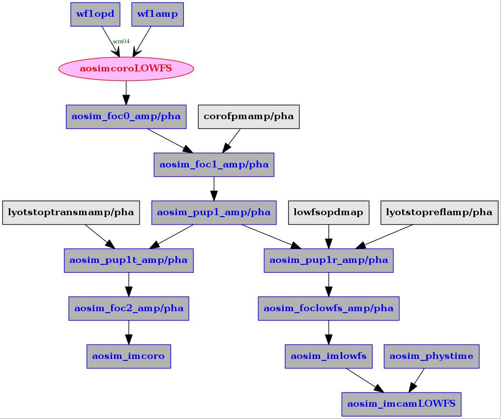
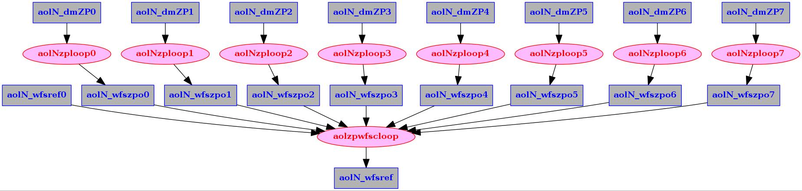

% AOloopControl
% Olivier Guyon
% Oct 1, 2017

# Initial Setup

## Scope

AO loop control package. Includes high-performance CPU/GPU computation engine and higher level scripts.

## Pre-requisites

Libraries required :

- gcc
- openMP
- fitsio
- fftw (single and double precision)
- gsl
- readline
- tmux
- bash dialog, version 1.2 minimum

Recommended:

- CUDA
- Magma
- shared memory image viewer (`shmimview` or similar)

## Installing the AdaptiveOpticsControl package

Source code is available on the [AdaptiveOpticsControl git hub repository](https://github.com/oguyon/AdaptiveOpticsControl).

Download the latest tar ball (.tar.gz file), uncompress, untar and execute in the source directory (`./AdaptiveOpticsControl-<version>/`)

	./configure
	
Include recommended high performance compile flags for faster execution speed:

	./configure CFLAGS='-Ofast -march=native'

If you have installed CUDA and MAGMA libraries:

	./configure CFLAGS='-Ofast -march=native' --enable-cuda --enable-magma

The executable is built with:

	make
	make install
	
The executable is `./AdaptiveOpticsControl-<version>/bin/AdaptiveOpticsControl`

Add `<srcdir>/scripts` to PATH environment variable. This is best done in the .bashrc file.

## Setting up the work directory

Conventions:

- `<srcdir>` is the source code directory, usually `.../AdaptiveOpticsControl-<version>`
- `<workdir>` is the work directory where the program and scripts will be executed. Note that the full path should end with `.../AOloop<#>` where `<#>` ranges from 0 to 9. For example, `AOloop2`.

The work directory is where all scripts and high level commands should be run from. You will first need to create the work directory and then load scripts from the source directory to the work directory.

First, execute from the source directory the 'syncscript -e' command to export key install scripts:

	mkdir /<workdir>
	cd <srcdir>/src/AOloopControl/scripts
	./syncscripts -e /<workdir>

The 'syncscript' script should now be in the work directory. Execute it to copy all scripts to the work directory:

	cd /<workdir>
	./syncscripts

Symbolic links to the source scripts and executable are now installed in the work directory (exact links / directories may vary) :

	olivier@ubuntu:/data/AOloopControl/AOloopTest$ ls -l
	total 32
	drwxrwxr-x 2 olivier olivier 4096 Sep 29 19:27 aocscripts
	drwxrwxr-x 2 olivier olivier 4096 Sep 29 19:27 aohardsim
	lrwxrwxrwx 1 olivier olivier   57 Sep 29 19:27 aolconf -> /home/olivier/src/Cfits/src/AOloopControl/scripts/aolconf
	drwxrwxr-x 2 olivier olivier 4096 Sep 29 19:27 aolconfscripts
	drwxrwxr-x 2 olivier olivier 4096 Sep 29 19:27 aolfuncs
	lrwxrwxrwx 1 olivier olivier   70 Sep 29 19:26 AOloopControl -> /home/olivier/src/Cfits/src/AOloopControl/scripts/../../../bin/cfitsTK
	drwxrwxr-x 2 olivier olivier 4096 Sep 29 19:27 aosetup
	drwxrwxr-x 2 olivier olivier 4096 Sep 29 19:27 auxscripts
	lrwxrwxrwx 1 olivier olivier   61 Sep 29 19:26 syncscripts -> /home/olivier/src/Cfits/src/AOloopControl/scripts/syncscripts

If new scripts are added in the source directory, running `./syncscripts` again from the work directory will add them to the work directory.

# Software Overview

At the low level, most operations are performed by calls to the [main executable](#main-executable) which is precompiled C code. The user interacts with a [high level ASCII-based GUI](#high-level-GUI), which performs calls to individual [scripts](#supporting-scripts) or directly execute instances of the main executable. 

The standard code layers are : [GUI](#high-level-gui) calls [SCRIPT](#supporting-scripts) calls [PRECOMPILED EXECUTABLE](#main-executable)

## High-level GUI

The top level script is `aolconf`. Run it with `-h` option for a quick help

	./aolconf -h

The `aolconf` script starts the main GUI screen from which sub-screens can be accessed. ASCII control GUI scripts are in the `aolconfscripts` directory. 

The scripts are listed below in the order they appear in the GUI menu. Boldface scripts corresponds to GUI screens. Supporting scripts (holding frequently used functions) are boldface italic.

------------------------------------ -----------------------------------------------------------
Script                               Description
------------------------------------ -----------------------------------------------------------
**aolconf_menutop**                  **GUI**: Top level menu

***aolconf_funcs***                  Misc functions

***aolconf_DMfuncs***                DM Functions

***aolconf_readconf***               Configuration read functions

***aolconf_menuview***               **GUI**: Data view menu

***aolconf_template***               Template (use to create additional GUI screens)

----CONFIGURATION------------------- setup configuration, links to hardware

**aolconf_menuconfigureloop**        **GUI**: Configure loop menu. Called from main menu

***aolconf_configureloop_funcs***    Functions used within the configureloop GUI screen

----CONTROL MATRIX------------------ compute control matrix

**aolconf_menucontrolmatrix**        **GUI**: Control matrix menu. Called from main menu

***aolconf_controlmatrix_funcs***    Functions used within the controlmatrix GUI screen

***aolconf_menu_mkFModes***          Make modes

----LOOP CONTROL-------------------- control AO loop

**aolconf_menucontrolloop**          **GUI**: Control loop menu. Called from main menu

***aolconf_controlloop_funcs***      Functions used within the controlloop GUI screen

----PREDICTIVE CONTROL-------------- WFS telemetry prediction and related AO control

***aolconf_menupredictivecontrol***  **GUI**:Predictive control

----TESTING------------------------- AO loop tests

**aolconf_menutestmode**             **GUI**: test mode menu

***aolconf_DMturb***                 DM turbulence functions

----LOGGING------------------------- Log telemetry

**aolconf_menurecord**               **GUI**: Record / log telemetry

***aolconf_logfuncs***               Data and command logging

------------------------------ -----------------------------------------------------------

## Supporting Scripts

Scripts are organized in directories according to their purpose 

------------------------------ -----------------------------------------------------------
Directory                      Description
------------------------------ -----------------------------------------------------------
aolconfscripts                 GUI scripts (see previous section)

aolfuncs                       Frequently used functions

auxscripts                     Auxillary scripts. Essential high level scripts in this directory.

aohardsim                      Hardware simulation

aocscripts                     Custom user-provided scripts to interact with non real-time hardware
------------------------------ -----------------------------------------------------------

The `auxscripts` directory are called by aolconf to perform various tasks. To list all commands, type in the `auxscripts` directory :

	./listcommands
	
For each script, the `-h` option will print help.

## Main executable

The main precompiled executable is `./AOloopControl`, which provides a command line interface (CLI) to all compiled code. Type `AOloopControl -h` for help. You can enter the CLI and list the available libraries (also called modules) that are linked to the CLI. You can also list the functions available within each module (`m? <module.c>`) and help for each function (`cmd? <functionname>`). Type `help` within the CLI for additional directions, and `exit` or `exitCLI` to exit the command line.

~~~
olivier@ubuntu:/data/AOloopControl/AOloop1$ ./AOloopControl 
type "help" for instructions
Running with openMP, max threads = 8  (defined by environment variable OMP_NUM_THREADS)
LOADED: 21 modules, 269 commands
./AOloopControl > exitCLI
Closing PID 5291 (prompt process)
~~~

## Memory storage and Configuration Parameters

AOCCE adopts a common shared memory data format for all data streams. The data structure is defined in file `<srcdir>/src/ImageStruct.h`. 

Configurations parameters are stored in directory `<workdir>/conf` as ASCII files. When AOCCEE is launched, it can load all required parameters and populate required shared memory streams from information contained in the `<workdir>/conf` directory.

# Hardware Simulation 

## Overview

There are 3 methods for users to simulate hardware

- METHOD 1: Provide an external simulation that adheres to AOloopControl input/output conventions

- METHOD 2: Use the physical hardware simulation provided by the package

- METHOD 3: Use the linear hardware simulation: this option is fastest, but only captures linear relationships between DM actuators and WFS signals

## METHOD 1: Provide an external simulation that adheres to AOloopControl input/output conventions

The user runs a loop that updates the wavefront sensor image when the DM input changes. Both the DM and WFS are represented as shared memory image streams. When a new DM shape is written, the DM stream semaphores are posted by the user, triggering the WFS image computation. When the WFS image is computed, its semaphores are posted.

## METHOD 2: Physical hardware simulation

The AOsim simulation architecture relies on individual processes that simulate subsystems. Each process is launched by a bash script. ASCII configuration files are read by each process. Data I/O can be done with low latency using shared memory and semaphores: a process operation (for example, the wavefront sensor process computing WFS signals) is typically triggered by a semaphore contained in the shared memory wavefront stream. A low-speed file system based alternative to shared memory and semaphores is also provided.

Method 2 simulates incoming atmospheric WFs, a pyramid WFS based loop feeding a DM, a coronagraphic LOWFS and coronagraphic PSFs.

### Running Method 2

Launch the simulator with the following steps:

- Create a series of atmospheric wavefronts (do this only once, this step can take several hrs):
	
		./aohardsim/aosimmkwfser

	Stop the process when a few wavefront files have been created (approximately 10 minimum). The AO code will loop through the list of files created, so a long list is preferable to reduce the frequency at which the end-of-sequence discontinuity occurs. The current wavefront file index is displayed as the process runs; in this example, the process is working on file #2:
	
		Layer  0/ 7, Frame   99/ 100, File      0/100000000  [TIME =     0.0990 s]  WRITING SCIENCE WAVEFRONT ... - 
		Layer  0/ 7, Frame   99/ 100, File      1/100000000  [TIME =     0.1990 s]  WRITING SCIENCE WAVEFRONT ... - 
		Layer  1/ 7, Frame   42/ 100, File      2/100000000  [TIME =     0.2420 s]  

	Type `CTRL-C` to stop the process. Note that you can relaunch the script later to build additional wavefront files.
	
	By default, the wavefront files are stored in the work directory. You may choose to move them to another location (useful if you have multiple work directories sharing the same wavefront files). You can then create a symbolic link `atmwf` to an existing atmospheric wavefront simulation directory. For example:

		ln -s /data/AtmWF/wdir00/ atmwf

- Execute master script `./aohardsim/runAOhsim`

- To stop the physical simulator: `./aohardsim/runAOhsim -k`

Important notes:

- Parameters for the simulation can be changed by editing the `.conf` files in the `aohardsim` directory

- You may need to kill and relaunch the main script twice after changing parameters

### Method 2 output streams

------------------------ -----------------------------------------------------------------------
Stream                   Description
------------------------ -----------------------------------------------------------------------
**wf0opd**               Atmospheric WF OPD

**wf0amp**               Atmospheric WF amplitude

**wf1opd**               Wavefront OPD after correction [um] ( = wf0opd - 2 x dm05dispmap )

**dm05disp**             DM actuators positions

**dm05dispmap**          DM OPD map

**WFSinst**              Instantaneous WFS intensity

**pWFSint**              WFS intensity frame, time averaged to WFS frame rate and sampled to WFS camera pixels

**aosim_foc0_amp**       First focal plane (before coronagraph), amplitude

**aosim_foc0_pha**       First focal plane (before coronagraph), phase

**aosim_foc1_amp**       First focal plane (after coronagraph), amplitude

**aosim_foc1_pha**       First focal plane (after coronagraph), phase

**aosim_foc2_amp**       Post-coronagraphic focal plane, amplitude

**aosim_foc2_pha**       Post-coronagraphic focal plane, phase
------------------ -----------------------------------------------------------------------

### Processes and scripts details

#### Process `aosimmkWF`

`aosimmkWF` reads precomputed wavefronts and formats them for the simulation parameters (pixel scale, temporal sampling).

Parameters for `aosimmkWF` are stored in configuration file:

File `aosimmkWF.conf.default` :

~~~~ {.numberLines}
!INCLUDE "../scripts/aohardsim/aosimmkWF.conf.default"
~~~~

#### Process `aosimDMrun`

File `aosimDMrun.conf.default` :

~~~~ {.numberLines}
!INCLUDE "../scripts/aohardsim/aosimDMrun.conf.default"
~~~~

#### Process `aosimPyrWFS`

File `aosimPyrWFS.conf.default` :

~~~~ {.numberLines}
!INCLUDE "../scripts/aohardsim/aosimPyrWFS.conf.default"
~~~~

### AO loop control

The ``aolconf`` script is used to configure and launch the AO control loop. It can be configured with input/output from real hardware or a simulation of real hardware.

#### Shared memory streams

------------------------------ -----------------------------------------------------------
Script                         Description
------------------------------ -----------------------------------------------------------
**wf0opd**                     Wavefront OPD prior to wavefront correction [um]

**wf1opd**                     Wavefront OPD after correction [um] ( = wf0opd - 2 x dm05dispmap )

**dm05disp**                   DM actuators positions

**dm05dispmap**                DM OPD map

**WFSinst**                    Instantaneous WFS intensity

**pWFSint**                    WFS intensity frame, time averaged to WFS frame rate and sampled to WFS camera pixels
------------------------------ -----------------------------------------------------------

#### Hardware simulation architecture

Close-loop simulation requires the following scripts to be launched to simulate the hardware, in the following order :

* ``aosimDMstart``: This script creates DM channels (uses dm index 5 for simulation). Shared memory arrays ``dm05disp00`` to ``dm05disp11`` are created, along with the total displacement ``dm05disp``. Also creates the ``wf1opd`` shared memory stream which is needed by `aosimDMrun` and will be updated by runWF. ``wf1opd`` is the master clock for the whole simulation, as it triggers DM shape computation and WFS image computation.
* ``aosimDMrun``: Simulates physical deformable mirror (DM)
* ``aosimmkWF``: Creates atmospheric wavefronts
* ``aosimWFS``: Simulates WFS

Some key script variables need to coordinated between scripts. The following WF array size should match :

* ``WFsize`` in script ``aosimDMstart``
* ``ARRAYSIZE`` in ``aosimmkWF.conf``
* ``ARRAYSIZE`` in ``aosimDMrun.conf``

The main hardware loop is between ``aosimmkWF`` and ``aosimWFS``: computation of a wavefront by ``aosimmkWF`` is *triggered* by completion of a WFS instantaneous image computation by ``aosimWFS``. The configuration files are configured for this link.

#### DM temporal response

The DM temporal response is assumed to be such that the distance between the current position $p$ and desired displacement $c$ values is multiplided by coefficient $a<1$ at each time step $dt$. The corresponding step response is :

$c - p((k+1) dt) = (c - p(k dt)) a$

$c - p(k dt) = (c-p0) a^k$

$p(k dt) = 1-a^k$

The corresponding time constant is

$a^{\frac{t0}{dt}} = 0.5$

$\frac{t0}{dt} ln(a) = ln(0.5)$

$ln(a) = ln(0.5) dt/t0$

$a = 0.5^{\frac{dt}{t0}}$

### Processes and scripts: system ouput

The output (corrected) wavefront is processed to compute ouput focal plane images, and optionally LOWFS image.

#### Process `aosimcoroLOWFS`

Computes coronagraphic image output and LOWFS image

File `aosimcoroLOWFS.conf.default`:

~~~~ {.numberLines}
!INCLUDE "../scripts/aohardsim/aosimcoroLOWFS.conf.default"
~~~~

#### Ouput simulation architecture

## METHOD 3: Linear Hardware Simulation

### Overview

The Linear Hardware Simulation (LHS) uses a linear response matrix to compute the WFS image from the DM state. It is significantly faster than the Physical Hardware Simulation (PHS) but does not capture non-linear effects.

### Setup

- Create directory LHScalib:

~~~~
mkdir LHScalib
~~~~

- Download response matrix and reference, place them in directory `LHScalib`.

- Start GUI, loop 5, name simLHS

~~~~
./aolconf -L 5 -N simLHS
~~~~

- Start DM: index 04, 50 x 50; Auto-configure: main DM (no link); STOP -> (re-)START DM comb process

- Go to `TEST MODE` GUI

- Enter linear simulation zonal response matrix and linear simulation WFS reference (`zrespMlinsim` and `wfsref0linsim` selections at top of screen). 

- **Start linear simulator** (`lsimon` selection). The simulator reacts to changes in aol5_dmdisp (= dm04disp)

# AOloopControl setup and overview

## GUI description

The script `aolconf` starts the main GUI, from which all setup and control can be done. The GUI consists of several main screens, as shown below.

## Commands log

ALL commands are logged by the script : 

	./aolconfscripts/aollog

### Automatically generated internal command log (very detailed)

`aolconf` uses the script `aolconfscripts/aollog` to log commands and status into file `./logdir/<UTDATE>/logging/<LOOPNAME>.log`. A sym link to `aolconf.log` is created for convenience, so the log content can be viewed with:

~~~~
tail -f aolconf.log
~~~~

Inside the bash script, function `aoconflog` is used to call `aolconfscripts/aollog` with the proper loop name, as defined in the main `aolconf` script:

~~~
# internal log - logs EVERYTHING
function aoconflog {
./aolconfscripts/aollog "$LOOPNAME" "$@"
}
~~~

### User-provided UsExternal log (less verbose)

More important commands are logged simultaneously to the internal log and an external log. The user provides the command to externally log commands. The executable should be in the path, and named `aollogext`. The syntax is:

~~~
./aollogext <string>
~~~

The string usually consists of the loop name followed by comments.

Inside the bash script, function `aoconflogext` is used to call `aolconfscripts/aollog` with the proper loop name, as defined in the main `aolconf` script:

~~~
# external log, use for less verbose log
function aoconflogext {
./aolconfscripts/aollog -e "$LOOPNAME" "$@"
}
~~~

### Interactive user log

To start the interactive log script:

~~~
./aolconfscripts/aollog -i <LOOPNAME> NULL
~~~

Entries will be logged in the `./logdir/<UTDATE>/logging/<LOOPNAME>.log` file (with sym link to `aolconf.log`).

It is also common practice to start a `MISC` log for misc comments, also to be included in the external log:

~~~
./aolconfscripts/aollog -ie MISC NULL
~~~

The corresponding log can be viewed by:

~~~
tail -f logdit/<UTDATE>/logging/MISC.log
~~~

# Setting up the hardware interfaces

## Top level script

Start aolconf with loop number and loop name (you can ommit these arguments when launching the script again):

~~~~~
./aolconf -L 3 -N testsim
~~~~~

The loop name (`testsim` in the above example) will both allocate a name for the loop and execute an optional custom setup script. The software package comes with a few such pre-made custom scripts for specific systems / examples. When the `-N` option is specified, the custom setup script `./setup/setup_<name>` is ran. The script may make some of the steps described below optional.

You can check the current loop number and name settings with:

~~~~~
./aolconf -h
~~~~~

The script can also launch a pre-written CPU/OS configuration script named `./aocscripts/cpuconfig_<LOOPNAME>` :

~~~~
./aolconf -C
~~~~

## Setting the DM interface

There are four options for setting up the DM:

- [A] Connect to an existing DM

- [B] Create a new DM and connect to it

- [C] Create a new modal DM, mapped to an existing DM using another loop's control modes

- [D] Create a new modal DM, mapped to an existing DM channel using a custom set of modes

Before choosing an option, select if the DM to be controlled is `MODAL` or `ZONAL`. A zonal DM is one where the DM pixel locations map to physical actuator locations on the DM, allowing spatial filtering when creating control modes. With a zonal DM, each pixel of the DM map corresponds to a wavefront control mode, and spatial filtering functions are turned off. 

Options [C] and [D] are `MODAL` options, as the DM does not represent physical spatial actuators. These options build a virtual DM which controls another DM.

### Mode [A]: Connecting to an existing DM

1. **Set DM number** (`S` command in `Top Menu` screen). You should see its x and y size in the two lines below. If not, the DM does not exist yet (see next section).

2. **autoconfigure DM: main DM (nolink)** (`nolink` in `Top Menu` screen). This command automactically sets up the following symbolic links:
	- dm##disp00 is linked to aol#_dmO      (flat offset channel)
	- dm##disp02 is linked to aol#_dmRM     (response matrix actuation channel)
	- dm##disp03 is linked to aol#_dmC      (loop dm control channel)
	- dm##disp04 is linked to aol#_dmZP0    (zero point offset 0 actuation channel)
	- dm##disp05 is linked to aol#_dmZP1    (zero point offset 1 actuation channel)
	- dm##disp06 is linked to aol#_dmZP2    (zero point offset 2 actuation channel)
	- dm##disp07 is linked to aol#_dmZP3    (zero point offset 3 actuation channel)
	- dm##disp08 is linked to aol#_dmZP4    (zero point offset 4 actuation channel)
	- dm##disp   is linked to aol#_dmdisp   (total dm displacement channel)

3. **load Memory** (`M` in `Top Menu` screen). The dm performs the symbolic links to the DM channels.

### Mode [B]: Creating and Connecting to a DM

1. Set **DM number** (`S` command in `Top Menu` screen). 

2. Enter the desired **DM size** with the `dmxs` and `dmys` commands.

- OPTIONAL: **set DM delay** ('setDMdelayON' and 'setDMdelayval' in `Top Menu` screen)

3. **Create the DM streams** with the `initDM` command in the `Top Menu`. You may need to run the `stopDM` command first.

4. **autoconfigure DM: main DM (nolink)** (`nolink` in `Top Menu` screen). This command automactically sets up the following symbolic links:
	- dm##disp00 is linked to aol#_dmO      (flat offset channel)
	- dm##disp02 is linked to aol#_dmRM     (response matrix actuation channel)
	- dm##disp03 is linked to aol#_dmC      (loop dm control channel)
	- dm##disp04 is linked to aol#_dmZP0    (zero point offset 0 actuation channel)
	- dm##disp05 is linked to aol#_dmZP1    (zero point offset 1 actuation channel)
	- dm##disp06 is linked to aol#_dmZP2    (zero point offset 2 actuation channel)
	- dm##disp07 is linked to aol#_dmZP3    (zero point offset 3 actuation channel)
	- dm##disp08 is linked to aol#_dmZP4    (zero point offset 4 actuation channel)
	- dm##disp   is linked to aol#_dmdisp   (total dm displacement channel)
	
5. **Load Memory** (`M` in `Top Menu` screen). The dm performs the symbolic links to the DM channels.

### Mode [C]: Create a new modal DM, mapped to an existing DM using another loop's control modes

In this mode, the AO loop controls a virtual DM. The virtual actuators are correspond to modes controlling the zero point offset of another loop. In this section, I assume that **loopA** is the main loop (directly controls a physical DM) and that **loopB** is the virtual loop (this is the loop we are setting up).

1. Select **MODAL** DM (`DMmodeZ` in `Top Menu` screen)

2. Set **DM number** (`S` command in `Top Menu` screen). This is the DM index for loopB.

3. Set **DM x size** to the number of modes of loop A to be addressed by loop B's virtual DM

4. Set **DM y size** to 1 

5. **Auto-configure: DM output linked to other loop** (`dmolink` in `Top Menu` screen).
	1. choose loop index from which modes will be extracted (loop A index)
	2. choose offset channel in output loop
	This will set up several key parameters and files:
	- **DM-to-DM** mode will be set to 1, and associated streams:
		- **dm2dmM**    : **loopA** modes controlled by **loopB**
		- **dm2dmO**    : symbolic link to **loopA** DM channel controlled by **loopB**
	- **CPU-based dmcomb output WFS ref** will be set to 1, and associated streams:
		- **dmwrefRM**  : **loopA** WFS response to modes controlled by **loopB**
		- **dmwrefO**   : **loopA** WFS zero point offset

- **OPTIONAL: set DM delay** ('setDMdelayON' and 'setDMdelayval' in `Top Menu` screen)

6. **Create the DM streams** with the `initDM` command in the `Top Menu`.

7. **Load Memory** (`M` in `Top Menu` screen). The dm performs the symbolic links to the DM channels.

### Mode [D]: Create a new modal DM, mapped to an existing DM channel using a custom set of modes

In this mode, the AO loop controls a virtual DM. The virtual actuators correspond to modes controlling another DM stream. In this section, I assume that **loop A** is the main loop (directly controls a physical DM) and that **loop B** is the virtual (higher level) loop.

1. Choose DM index number (`S`) for loop B

2. Select number of loop A modes controlled by loop B. The number is entered as DM x size (`dmxs` in `Top menu`)

3. Enter 1 for DM y size (`dmys` in `Top menu`)

4. Set **DM-to-DM** mode to 1, and associated streams:
	- **dm2dmM**    : loop A modes controlled by loop B
	- **dm2dmO**    : symbolic link to loop A DM channel controlled by loop B

5. Set **CPU-based dmcomb output WFS ref** to 0 (see section below more enabling this option)

6. **(Re)-create DM streams and run DMcomb process** (`initDM`) 

7. **Load Memory** (`M` in `Top Menu` screen). The dm performs the symbolic links to the DM channels.

Commands to the loop B DM should now propagate to modal commands to loop A.

### Option: WFS Zero point offset

It is possible to add a zero point offset to mode D. Every write to the loop B's modal DM then generate both a write to loop A's DM (described above) and a write to the reference of a wavefront sensor (presumably loop A's wavefront sensor). This optional feature is refered to as a CPU-based WFS zero point offset.

To enable this feature, add between steps 4 and 5:

1. set **CPU-based dmcomb output WFS ref** to 1, and associated streams:
	- **dmwrefRM**  : **loopA** WFS response to modes controlled by **loopB**
	- **dmwrefO**   : **loopA** WFS zero point offset
 
 

### Notes
	
You can (Re-)Start DM comb to re-initialize arrays and links ('stopDM' and 'initDM' commands in `Top Menu` screen). The `initDM` command will

- (re-)create shared memory streams dm##disp00 to dm##disp11
- start the dmcomb process, which adds the dm##disp## channels to create the overall dm##disp displacement
- create poke mask and maps

## Setting the camera interface

- **link to WFS camera** (`wfs` to `Loop Configuration` screen). Select the WFS shared memory stream. 

## Setup script

An `aosetup` script may be used to perform all these operations. Inspect the content of directory `aosetup` to see such scripts. You may use or modify as needed. If you use a `aosetup` script, execute it from the working directory, and then start aolconf:

~~~
./aosetup/aosetup_<myLoop>
./aolconf
~~~

# Calibration

## Acquiring a zonal response matrix 

- **set response matrix parameters** in `Loop Configure` screen: amplitude, time delay, frame averaging, excluded frames

- **set normalization and Hadmard modes** in `Loop Configure` screen. Normalization should probably be set to 1.

- **start zonal response matrix acquisition** (`zrespon` in `Loop Configure` screen). The process runs in tmux session aol#zrepM.

- **stop zonal response matrix acquistion** (`zrespoff` in `Loop Configure` screen). 

The following files are then created:

----------------------------- ------------------------------------ -----------------------------------------------------------
File                          Archived location                    Description
----------------------------- ------------------------------------ -----------------------------------------------------------
**zrespmat.fits**             zrespM/zrespM_${datestr}.fits        zonal response matrix

**wfsref0.fits**              wfsref0/wfsref0_${datestr}.fits      WFS reference (time-averaged image)

**wfsmap.fits**               wfsmap/wfsmap_${datestr}.fits        Map of WFS elements sensitivity

**dmmap.fits**                dmmap/dmmap_${datestr}.fits          Map of DM elements sensitivity

**wfsmask.fits**              wfsmask/wfsmask_${datestr}.fits      WFS pixel mask, derived from wfsmap

**dmmaskRM.fits**             dmmaskRM/dmmaskRM_${datestr}.fits    DM actuator mask, derived from dmmap by selecting actuators with strong response

**dmslaved.fits**             dmslaved/dmslaved_${datestr}.fits    slaved DM actuators: actuators near active actuators in dmmaskRM

**dmmask.fits**               dmmask/dmmask_${datestr}.fits        DM mask: all actuators controlled (union of dmmaskRM and dmslaved)
----------------------------- ------------------------------------ -----------------------------------------------------------

Note that at this point, the files are NOT loaded in shared memory, but the archieved file names are stored in the staging area "conf_zrm_staged/conf_streamname.txt" for future loading.

- **Adopt staged configuration** (`upzrm` in `Loop Configure` screen)

- **Load zrespm files into shared memory** (`SMloadzrm` in `Loop Configure` screen)

	
## Acquiring a modal response matrix (optional, for ZONAL DM only)

In addition to the zonal response matrix, a modal response matrix can be acquired to improve sensitivity to low-oder modes.

To do so: 

- activate `RMMon` to **toggle the modal RM on**.

- **select RM amplitude and maximum cycles per aperture (CPA)**

- **start the acquisiton** (`LOresp_on`)

- **stop the acquisiton** (`LOresp_off`)

The following files are then created:

----------------------------- ------------------------------------ -----------------------------------------------------------
File                          Archived location                    Description
----------------------------- ------------------------------------ -----------------------------------------------------------
**LOrespmat.fits**            LOrespM/LOrespM_${datestr}.fits      Modal response matrix

**respM_LOmodes.fits**        LODMmodes/LODMmodes_${datestr}.fits  Low-order modes

**LOwfsref0.fits**            LOwfsref0/LOwfsref0_${datestr}.fits  WFS reference measured during LO RM acquisition

**LOwfsmap.fits**             LOwfsmap/LOwfsmap_${datestr}.fits    Map of WFS elements sensitivity

**LOdmmap.fits**              LOdmmap/LOdmmap_${datestr}.fits      Map of DM elements sensitivity

**LOwfsmask.fits**            LOwfsmask/LOwfsmask_${datestr}.fits  WFS pixel mask, derived from wfsmap

**LOdmmask.fits**             LOdmmask/LOdmmask_${datestr}.fits    DM actuator mask, derived from dmmap by selecting actuators with strong response
----------------------------- ------------------------------------ -----------------------------------------------------------

Note that at this point, the files are NOT loaded in shared memory, but the archieved file names are stored in the staging area "conf_mrm_staged//conf_streamname.txt" for future loading.

- **Adopt staged configuration** (`upmrm` in `Loop Configure` screen)

- **Load LOrespm files into shared memory** (`SMloadmrm` in `Loop Configure` screen)

## Automatic system calibration (recommended)

The automatic system calibration performs all steps listed above under zonal and modal response matrix acquisition.

The old calibrations are archived as follows:

- "conf_zrm_staged" and "conf_mrm_staged" hold the new configuration (zonal and modal respectively)

- "conf_zrm_staged.000" and "conf_mrm_staged.000" hold the previous configuration (previously "conf_zrm_staged" and "conf_mrm_staged")

- "conf_zrm_staged.001" and "conf_mrm_staged.001" hold the configuration previously named "conf_zrm_staged.000" and "conf_mrm_staged.000"

- etc for a total of 20 configuration

  

## Managing configurations

At any given time, the current configuration (including control matrices if they have been computed) can be saved using the `SAVE CURRENT SYSTEM CALIBRATION` command. Saving a configuration will save all files in the conf directory into a user-specified directory.

Previously saved configurations can be loaded with the `LOAD SAVED SYSTEM CALIBRATION` command. This will load saved files into the conf directory and load all files into shared memory.

# Building control matrix

- **set SVDlimit** (`SVDla` in `Control Matrix` screen). Set value is 0.1 as a starting point for a stable loop.

- **perform full CM computation** (`mkModes0` in `Control Matrix` screen). Enter first the number of CPA blocks you wish to use. Computation takes a few minutes, and takes place in tmux session `aol#mkmodes`.

The following files are created:

----------------------------- ----------------------------------------- -----------------------------------------------------------
File                          Archived location                         Description
----------------------------- ----------------------------------------- -----------------------------------------------------------
**aolN_DMmodes**              Mmodes/DMmodes_${datestr}.fits            DM modes

**aolN_respM**                respM/respM_${datestr}.fits               WFS response to DM modes
----------------------------- ----------------------------------------- -----------------------------------------------------------

Block-specific files:

----------------------------- ----------------------------------------- -----------------------------------------------------------
File                          Archived location                         Description
----------------------------- ----------------------------------------- -----------------------------------------------------------
**aolN_DMmodesbb**            DMmodes/DMmodesbb_${datestr}.fits         DM modes for block bb

**aolN_respMbb**              respM/respMbb_${datestr}.fits             WFS response to DM modes for block bb

**aolN_contrMbb.fits**        contrM/contrMbb_${datestr}.fits           Control matrix for block bb

**aolN_contrMcbb.fits**       contrMc/contrMcbb_${datestr}.fits         Collapsed control matrix for block bb

**aolN_contrMcactbb.fits**    contrMcact/contrMcactbb_${datestr}.fits   Collabsed control matrix for block bb, only active actuators
----------------------------- ----------------------------------------- -----------------------------------------------------------

Note that at this point, the files are NOT loaded in shared memory, but the archieved file names are stored in "conf/conf_<streamname>.txt" for future loading.

- **Load CM files into shared memory** (`SMloadCM` in `Control Matrix` screen)

# Running the loop: Choosing hardware mode (CPU/GPU)

There are multiple ways to perform the computations on CPU and/or GPUs. The main 3 parameters are:

- **GPU**     : 0 if matrix multiplication(s) done on CPU, >0 for GPU use. This is the number GPUs to use for matrix mult.

- **CMmode**  : 1 if using a combined matrix between WFS pixels and DM actuators, skipping intermediate computation of modes

- **GPUall**  : if using GPUall, then the WFS reference subtraction is wrapped inside the GPU matrix multiplication

------- --------- --------- ------------ ---------- --------------------------------------------------------------------------------
GPU     CMmode    GPUall    Matrix       Features   Description
------- --------- --------- ------------ ---------- --------------------------------------------------------------------------------
>0      ON         ON       contrMcact   fastest    dark-subtracted WFS frame imWFS0 is multiplited by collapsed control matrix (only active pixels).
                                         no mcoeff  normalization and WFS reference subtraction are wrapped in this GPU operation as subtraction of pre-computed vector output.
                                                    This is the fastest mode.
                            
>0      ON         OFF      contrMcact              WFS reference is subtracted from imWFS0 in CPU, yielding imWFS2.                         
                                                    imWFS2 is multiplied by control matrix (only active pixels) in GPU.
                            
>0      OFF        OFF      contrM                  MWFS reference is subtracted from imWFS0 in CPU, yiedling imWFS2.
                                                    imWFS2 is multiplied (GPU) by control matrix to yield mode values.
                                                    Mode coefficients then multiplied (GPU) by modes.

0       ON         -        contrMcact              imWFS2 is multiplied by control matrix (only active pixels) in CPU

0       OFF        -        contrM                  imWFS2 multiplied by modal control matrix
------- --------- --------- ------------ ----------- ---------------------------------------------------------------------

# Auxilliary processes

A number of auxilliary processes can be running in addition to the main loop operation.

## Extract WFS modes

Launches script `./auxscripts/modesextractwfs` :

~~~ {.numberLines}
!INCLUDE "../scripts/auxscripts/modesextractwfs"
~~~

Converts WFS residuals into modes.

## Extract open loop modes

Launches script C function (CPU-based):

~~~
key       :    aolcompolm
module    :    AOloopControl.c
info      :    compute open loop mode values
syntax    :    <loop #>
example   :    aolcompolm 2
C call    :    long AOloopControl_ComputeOpenLoopModes(long loop)
~~~

This function is entirely modal, and assumes that the WFS modes (see section above) are computed. The key input to the function is `aolN_modeval`, the WFS residual mode values. The function uses this telemetry and knowledge of loop gain and mult factor to track open loop mode values.

Optionally, it also includes `aolN_modeval_pC`, the predictive control mode values that are added to the correction in predictive mode.

## Running average of dmC

Launches script `./auxscripts/aol_dmCave 0.0005` :

~~~ {.numberLines}
!INCLUDE "../scripts/auxscripts/aol_dmCave"
~~~

## Compute and average wfsres

Launches script `./auxscripts/aolmkWFSres 0.0005` :

~~~ {.numberLines}
!INCLUDE "../scripts/auxscripts/aolmkWFSres"
~~~

# Offsetting

Input channels are provided to offset the AO loop convergence point. By default, **DM channels 04-11 can be dedicated to zero-point offsetting**. The DM channels are sym-linked to `aolN_dmZP0` - `aolN_dmZP7`.

Zero-point offsetting relies on two separate processes :

- Converting DM offsets to WFS offsets (can be done by CPU or GPU): aolN_dmZP -> aolN_wfszpo
- Summing and applying WFS offsets aolN_wfszpo to aolN_wfsref

## Converting DM offsets to WFS offsets (zonal, CPU mode)

CPU-based zero point offsets will compute WFS offsets from the zero point offset DM channels (04-11) and apply them to the `aolN_wfszpo#` stream. 

- **Activate CPU individual zero point offset channels** (`zplon0` to `zplon7`) to convert dm zero point displacements to wfs offsets.

Every time one of the activated DM channel changes, the corresponding wfs `aolN_wfszpo#` zero point offset is CPU-computed.

The process runs inside tmux session `aolNzploop#`

## Converting DM offsets to WFS offsets (zonal, GPU mode)

A faster GPU-based zero point offset from DM to WFS is provided for each of the 8 offset channels. GPU-based and CPU-based offsetting for a single channel are mutually exclusive.

- **Activate GPU individual zero point offset channels** (`GPUzplon0` to `GPUzplon7`) to convert dm zero point displacements to wfs offsets.

Every time one of the activated DM channel changes, the corresponding wfs `aolN_wfszpo#` zero point offset is GPU-computed.

The process runs inside tmux session `aolNGPUzploop#`

## Modal offsetting from another loop

The two methods above are zonal offsetting: the DM map is multiplied by the zonal WFS response to compute WFS offset. 

Modal offsetting, instead, relies on a pre-computed set of WFS modal offets. This is most useful when a separate control loop is driving modal offsets to the current loop.

To implement modal offsetting from a separate loop (refered to as the offsetting loop) : 

- Configure the DM of the offsetting loop to write WFS zero point offsets to the current loop (see setting up DM section)

- Do not activate either of the previous two zonal offsetting schemes

- Activate the WFS offsets process (see next subsection)

## Summing and applying WFS offsets to aolN_wfsref

To activate WFS offsets to aolN_wfsref, the user needs to :

- **Toggle the zero point offset loop process ON** (`LPzpo`) prior to starting the loop. 

Command `aolzpwfscloop` (C function `AOloopControl_WFSzeropoint_sum_update_loop`) launches a loop that monitors shared memory streams `aolN_wfszpo0` to `aolN_wfszpo7`, and updates the WFS reference when one of these has changed.

The loop is running inside tmux session `aolNwfszpo`, and is launched when the loop is closed (`Floopon`) if the loop zero point offset flag is toggled on (`LPzpo`)

## WFS average offset

Measures average WFS residual with script :

	./auxscripts/aolmkWFSres 0.0005
	
Running average is in stresm aol_wfsres_ave

# Controlling offsets from another loop
 

## Running the loop

The next steps are similar to the ones previously described, with the following important differences:

- The control matrix should be computed in zonal mode (no modal CPA block decomposition)

# Predictive control (experimental)

## Overview

Predictive control is implemented in two processes:

- The optimal auto-regressive (AR) filter predicting the current state from previous states is computed. The AR filter is computed from open-loop estimates, so the processes computing open-loop telemetry need to be running.

- the AR filter is applied to write a prediction buffer, which can be written asynchronously from the main loop steps.

The predictive filter is modal, and adopts the same modes as the main control loop.

## Scripts

----------------------------- -----------------------------------------------------------
File                          Description
----------------------------- -----------------------------------------------------------
**aolARPF**                   find auto-regressive predictive filter

**aolARPFblock**              AO find optimal AR linear predictive filter 
----------------------------- -----------------------------------------------------------

## Data flow

Predictive control is set up by blocks of modes. A block is configured through the aolconf predictive control sub-panel, which writes to configuration files `conf/conf_PFblock_XXX.txt`, where XXX is the block number (000, 001, 002 etc...). Configuration files specify the modes within each block (index min to index max), the predictive filter order, time lag and and averaging gain.

For each block, there are 3 main processes involved in running the predictive control:

- **Watching input telemetry** this process listens to the input telemetry stream and periodically writes data to be used to compute a filter. This runs function `long AOloopControl_builPFloop_WatchInput(long loop, long PFblock)` in `AOloopControl.c`.

- **Computing filter**. Runs CLI command `mkARpfilt`, which runs function `LINARFILTERPRED_Build_LinPredictor` in `linARfilterPred.c`.

- **Prediction engine** (= apply filter). Runs script `./auxscripts/predFiltApplyRT`.

All 3 processes work in a chain, and can be turned on/off from the GUI.

# APPENDIX A: SHARED MEMORY STREAMS

## Linking to existing stream 

Creates a sym link from an existing stream to a new stream. This is frequently used to connect to hardware (for example pointing aol8_wfsim to the WFS camera stream).

Within AOCCE, setting (new) stream aol#_\<deststream\> to point to \<srcstream\> involves:

- writing "\<srcstream\>" to file conf/streamlink_\<deststream\>.name.txt
- removing any existing aol#_\<deststream\> stream 
- establishing sym link from \<srcstream\> to aol#_\<deststream\>

The corresponding commands, to point aol8_wfsim to imcam, would be:

	echo "imcam" > conf/streamlink_wfsim.name.txt
	rm /tmp/aol8_wfsim.im.shm
	ln -s /tmp/imcam.im.shm /tmp/aol8_wfsim.im.shm

This is implemented in script :

	./aolfuncs/aolfunc_StreamLink

## Loading images from FITS to shared memory stream

### Overview

Loading FITS file into a new or existing stream.

The recommended command to load a FITS image to shared memory in AOCCE is for example:

	echo "./wfsref0/wfsref0_today.fits" > ./conf/shmim_wfsref0.name.txt
	Fits2shm -c -p aol${LOOPNUMBER}_ wfsref0

This command will skip loading if the stream does not need to be updated from the last load command. Add the -f option to force loading.

Options used:

     -c           read FITS file name from ./conf/shmim_<streamname>.name.txt directory
     -p <pref>    stream prefix

### Detailed description

File name can be :

- option A: read from ./conf/shmim_\<stream\>.name.txt
- option B: specfied and written to ./conf/shmim_\<stream\>.name.txt

Command for option A:

	Fits2shm <FITS file> <stream>

Command for option B:

	Fits2shm -c <stream>

A prefix is usually added to the shared memory file with the -p option:

	Fits2shm -c -p aol8_ <stream>

The -r removes/clears any previous instance of the stream and associated files: it is a stronger option than -f.

Fits2shm is located in the src/scripts/ directory of the AOCCE source code.

For both options, FITS files and shared memory files are inspected to assess need to load the image. If repetitive load requests are issued on the same file and shared memory, the script may decide that no action is required as the shared memory is already up-to-date.

Local directory ./loadedSM/ is used to keep track of streams loaded from FITS files. 

Important files:

------------------------------------- ----------------------------------------
File                                  Description
------------------------------------- ----------------------------------------
./loadedSM/\<stream\>.FITSinfo          FITS file name, size, time of last modification

./loadedSM/\<stream\>.FITSinfo.old      previous version of above file - to be used for comparison

./loadedSM/\<stream\>.FITSsame          File exists if the two FITS files are identical

./loadedSM/\<stream\>.FITSchanged       File exists if the two FITS files are different

./loadedSM/\<stream\>.SMinfo            stream file name, size, time of last modfification

./loadedSM/\<stream\>.SMinfo.old        previous version of above file - to be used for comparison

./loadedSM/\<stream\>.SMsame            File exists if the two SM files are identical

./loadedSM/\<stream\>.SMchanged         File exists if the two SM files are different

./loadedSM/\<stream\>.imsize            Image size - updated upon SM load

./loadedSM/\<stream\>.new               File exists if last load request updated or created stream

./loadedSM/\<stream\>.kept              File exists if last load request kept stream unchanged

./loadedSM/\<stream\>.missing           File exists if last load request created new stream (stream was missing)

./conf/shmim_\<stream\>.name.txt         FITS file name for stream

./conf/shmim_\<stream\>.imsize.txt       Stream size

./conf/shmim_\<stream\>.fits            (symbolic link to) FITS file

./tmp/\<prefix\>\<stream\>.im.shm       File-mapped shared memory
------------------------------------- -----------------------------------------------------------

The logic behind Fits2shm is as follows:

- Assume LOAD=0 (do not load FITS file in memory)
- Check if FITS file has changed. If yes, set LOAD=1
- Check if SM file has changed. If yes, set LOAD=1
- Check if SM file exists, if not:
	- set LOAD=1
	- create \<stream\>.missing file (otherwise, rm \<stream\>.missing file)
- Check if FORCE option, if yes, set LOAD=1
- If LOAD=1:
	- load file to shared memory
	
	
When loading :	

- OPTION A only: update ./conf/shmim_\<stream\>_name.txt to the FITS file name 	
- update ./loadedSM/\<stream\>.FITSinfo file
- update ./loadedSM/\<stream\>.SMinfo file
- create ./loadedSM/\<stream\>.kept OR ./loadedSM/\<stream\>.new file, remove the other one
- create ./loadedSM/\<stream\>.missing file if the SM file did not exist, otherwise remove ./loadedSM/\<stream\>.missing
- copy ./loadedSM/\<stream\>.imsize file to ./conf/shmim_\<stream\>.imsize.txt
- load FITS file to ./tmp/\<prefix\>\<stream\>.im.shm
- create sym link ./conf/shmim_\<stream\>.fits pointing to FITS file
	

# APPENDIX B: CONF DIRECTORY

## Overview

The conf directory contains the following file types:

------------------------------------- ----------------------------------------
File Type                             Description
------------------------------------- ----------------------------------------
conf_XXXX.txt                         Information about the configuration (name etc...)

param_XXXXX.txt                       AOCCE parameter, usually written by GUI            

streamlink_XXXX.txt                   shared memory link name for AOCCE stream XXXX     

shmim_XXXX.name.txt                   Name of FITS file to be loaded to shared memory

shmim_XXXX.imsize.txt                 Image size of FITS file loaded to shared memory (written by Fits2shm)

shmim_XXXX.fits                       Sym link to FITS file loaded to shared memory (created by Fits2shm)

instconf_XXXXX.txt                    Instrument-specific configuration (filter wheels, stages.. )
------------------------------------- ----------------------------------------

## Parameters

### Overall and misc

------------------------------------- ----------------------------------------
File                                  Description
------------------------------------- ----------------------------------------
param_CPUset_mode.txt                 1 if using CPUset

param_wfslambdanm.txt                 WFS wavelength \[nm\]
------------------------------------- ----------------------------------------

### Linear Hardware Simulator

------------------------------------- ----------------------------------------
File                                  Description
------------------------------------- ----------------------------------------
param_linsimDelay.txt                 Linear Hardware Simulator (LHS) hardware latency \[us\]

param_linsimdt.txt                    Linear Hardware Simulator (LHS) loop interval \[us\]

param_GPUlinsim.txt                   Linear Hardware Simulator (LHS) GPU index
------------------------------------- ----------------------------------------

### DM 

------------------------------------- ----------------------------------------
File                                  Description
------------------------------------- ----------------------------------------
param_DMindex.txt                     DM index (00, 01, 02 ... )

param_DMMODE.txt                      ZONAL (default) or MODAL

param_DMxsize.txt                     DM x size

param_DMysize.txt                     DM y size

param_DM2DM_mode.txt                  DM-to-DM more. 1 if this DM drives another DM, 0 otherwise

param_DMwfsref_mode.txt               1 for CPU-based dmcomb DM ouput applied as WFS offset

param_DMvolt_mode.txt                 1 if DM voltages applied (requires stream "dmvolt")

param_DMcombave_mode.txt              DM averaging mode (default = 0)

param_DMdelayON.txt                   1 if DM delay introduced

param_DMdelayus.txt                   DM delay value \[us\]
------------------------------------- ----------------------------------------

### Timing

------------------------------------- ----------------------------------------
File                                  Description
------------------------------------- ----------------------------------------
param_loopfrequ.txt                   WFS camera frequency \[Hz\]

param_hardwlatency.txt                Hardware latency \[s\]

param_hardwlatency_frame.txt          Hardware latency \[frame\]

param_complatency.txt                 Computation latency \[s\]

param_complatency_frame.txt           Computation latency \[frame\]

param_wfsmextrlatency.txt             Modal reconstruction latency \[s\]

param_wfsmextrlatency_frame.txt       Modal reconstruction latency \[frame\]

param_nblatm.txt                      Number of cycles in latency measurement
------------------------------------- ----------------------------------------

### Response Matrix acquisition

------------------------------------- ----------------------------------------
File                                  Description
------------------------------------- ----------------------------------------
param_ACzrmtime.txt                   Max running time for zonal RM acquisition \[s\]

param_ACzrmNBcycle.txt                Max number of cycles for zonal RM acquition

param_ACmrmtime.txt                   Max running time for monal RM acquisition \[s\]

param_ACmrmNBcycle.txt                Max number of cycles for modal RM acquition

param_RMdelayfr.txt                   RM acquisition delay \[frame\]

param_RMfrave.txt                     RM acquisition number of frames averaged per poke

param_RMexft.txt                      RM acquisition number of frames excluded during poke transition

param_RMamplum.txt                    RM acquisition amplitude \[um\]

param_delayRM1us.txt                  RM acquisition delay 1 \[s\]

param_RMpokeMode.txt                  RM poking mode. 0=zonal, 1=Hadamard.

param_RMMamplum.txt                   RM Low Order Modal acquisition amplitude \[um\]

param_RMMcpa.txt                      RM Low Order Modal max CPA

param_WFSnorm.txt                     Normalize WFS frames

param_DMmaskRMp0.txt                     

param_DMmaskRMc0.txt                     

param_DMmaskRMp1.txt                     

param_DMmaskRMc1.txt                     

param_WFSmaskRMp0.txt                     

param_WFSmaskRMc0.txt                     

param_WFSmaskRMp1.txt                     

param_WFSmaskRMc1.txt                     

param_WFSmaskSNRr.txt                     

param_RMCalibReuseMasks.txt            1 if calibration masks reused (0 if re-computed)                     

param_.txt                     
------------------------------------- ----------------------------------------

### Modess and Control Matrix computation

------------------------------------- ----------------------------------------
File                                  Description
------------------------------------- ----------------------------------------
param_MASKS_LOCK.txt                  1 if WFS and DM masks are locked

param_NBmodeblocks.txt                Number of mode blocks (default=1)
------------------------------------- ----------------------------------------

### Loop Control

------------------------------------- ----------------------------------------
File                                  Description
------------------------------------- ----------------------------------------
param_DMprimWriteON.txt               Primary Write ON/OFF (0 or 1)

param_CMMODE.txt                      Combined Matrix (0 or 1)

param_GPU.txt

param_GPUmodesextrwfs.txt             WFS mode coefficients extraction: GPU device

param_GPUdmfwb.txt                    DM modal write (post-filtering): GPU device

param_GPUzpoffsetZ.txt                Zonal WFS zero point offset loop: GPU device

param_GPUzpoffsetM.txt                Modal WFS zero point offset loop: GPU device

param_LOOPPROCESS_EXTRWFSMODES.txt 

param_LOOPPROCESS_EXTROLMODES.txt 

param_LOOPPROCESS_DMFILTWB.txt 

param_LOOPPROCESS_ZPO.txt 

param_LOOPPROCESS_DMCAVE.txt 

param_LOOPPROCESS_WFSRESAVE.txt 

param_AUTOTUNELIMITS_ON.txt           Autotuning ON/OFF (ON or OFF)

param_AUTOTUNELIMITmcoeff.txt         Autotuning limits

param_AUTOTUNELIMITdelta.txt          Autotuning limits

param_AUTOTUNEGAINS_ON.txt            Autotuning gain (ON or OFF)

param_ARPFon.txt                      Auto-regressive predictive filter (ON or OFF)

param_ARPFg.txt                       Auto-regressive predictive filter gain

param_loopgain.txt

param_loopmmultcoeff.txt

param_loopmaxlim.txt                  Limit of DM actuators (direct write only)

------------------------------------- ----------------------------------------

## Stream Links

------------------------------------- ----------------------------------------
File                                  Description
------------------------------------- ----------------------------------------
streamlink_dmC.name.txt               DM correction stream

streamlink_dmO.name.txt               DM offset stream (DM flat channel)

streamlink_dmZP0.name.txt             DM zero point offset #0 stream

streamlink_dmZP1.name.txt             DM zero point offset #1 stream

streamlink_dmZP2.name.txt             DM zero point offset #2 stream

streamlink_dmZP3.name.txt             DM zero point offset #3 stream

streamlink_dmZP4.name.txt             DM zero point offset #4 stream

streamlink_dmZP5.name.txt             DM zero point offset #5 stream

streamlink_dmZP6.name.txt             DM zero point offset #6 stream

streamlink_dmZP7.name.txt             DM zero point offset #7 stream

streamlink_dmdisp.name.txt            DM total displacement stream

streamlink_dmRM.name.txt              DM response matrix stream

streamlink_dm2dmM.name.txt            DM modes controlled in DM-to-DM mode (optional)

streamlink_dm2dmO.name.txt            DM modes output in DM-to-DM mode (optional)

streamlink_dmwrefRM.name.txt          WFS ref RM (optional)

streamlink_dmwrefO.name.txt           WFS output (optional)

streamlink_wfsim.name.txt             WFS image
------------------------------------- ----------------------------------------

## Shared memory FITS file initializations to streams

File shmim_\<stream\>.name.txt contain the FITS file names that are loaded into shared memory streams aol\<loop\>_\<stream\>.

------------------------------------- ----------------------------------------
File                                  Description
------------------------------------- ----------------------------------------
shmim_wfsdark.name.txt                WFS dark

shmim_wfsmap.name.txt                 WFS response map

shmim_wfsmask.name.txt                WFS mask

shmim_dmmap.name.txt                

shmim_dmmaskRM.name.txt                

shmim_dmslaved.name.txt                

shmim_dmmask.name.txt                

shmim_wfsref0.name.txt                

shmim_zrespM.name.txt                

shmim_LODMmodes.name.txt                

shmim_LOrespM.name.txt                

shmim_DModes.name.txt                

shmim_respM.name.txt                

shmim_contrM.name.txt                

shmim_DMmodesXX.name.txt                

shmim_respMXX.name.txt                

shmim_contrMXX.name.txt                

shmim_contrMcXX.name.txt                

shmim_contrMcactXX_00.name.txt                
------------------------------------- ----------------------------------------

## FITS files

------------------------------------- ----------------------------------------
File                                  Description
------------------------------------- ----------------------------------------
RMpokeCubeZ.fits.gz                   Simple Zonal poke mode

RM_DMmask.fits.gz                     mask for creating RM Hadamard pokes

Hpoke.fits.gz                         Hadamard poke modes

Hmat.fits.gz                          Hadamard-zonal transformation matrix

Hpixindex.fits.gz                     Hadamard DM pixel index 

RMmat.fits.gz                         Current poke transformation matrix (optional)

RMpixindex.fits.gz                    Current DM pixel index

RMpokeCube.fits.gz                    Current poke modes
------------------------------------- ----------------------------------------

# REFERENCE: Content of ./status directory

The status directories contrains the current state of the AOCCE processes.

------------------------------------- ----------------------------------------
File                                  Description
------------------------------------- ----------------------------------------
stat_DMcombON.txt                     " ON" if DMcomb is running, "OFF" otherwise

stat_lsimON.txt                       " ON" if linear hardware simulator is running, "OFF" otherwise
------------------------------------- ----------------------------------------

# APPENDIX C: STEP-BY-STEP EXAMPLE

## Starting the linear hardware simulator

**STEP 1**: Create directory `<workdir>`

**STEP 2**: Install scripts into `<workdir>`:

	cd <srcdir>/src/AOloopControl/scripts
	syncscripts -e <workdir>
	cd <workdir>
	./syncscripts

**STEP 3**: Download a calibration, consisting of zonal response matrix and a WFS reference. Place the file in a new directory `<workdir>/simLHS`

**STEP 4**: Launch aolconf, loop number 5, loop name simtest:

	./aolconf -L 5 -N simtest
	
Note that you subsequent calls to aolconf should then be without the -L and -N options.

**STEP 5**: Set DM size to match the calibration. `dmxs` and `dmys` GUI top menu.

**STEP 6**: Autoconfigure DM: `dmnolink` in GUI top menu.

**STEP 7**: Turn off dmvolt: `dmvolt0` in GUI top menu.

**STEP 8**: Set DM averaging mode to 2: `dmcombam` in GUI top menu.

**STEP 9**: Start DMcomb. `initDM` in GUI top menu.

**STEP 10**: Load all memory. `M` in GUI top menu

**STEP 11**: Link LHS files

**STEP 12**: Start the LHS process

## Acquiring calibration, compute control matrix

Under configuration GUI menu :

- Measure hardware timing: `mlat`
- set Hadamard mode to ON: `Hon`
- set RM modal to ON: `RMMon`
- Acquire automatic calibration: `nAUTOc`

Under control matrix GUI menu :

- Select maximum control spatial frequency: `modeCPA`
- Create modes and control matrix: `mkModes0`
- update configuration: `confUp`

Load and manage configuration :

- load configuration
- save configuration

# APPENDIX D: Managing multiple processes

Note: Here, a process can consist of any operation or set of operations, as defined by the user. In this appendix, a process does not strictly correspond to a CPU process.

AOCCE's bash script includes tools to manage logical links between processes. A process can be **queued**, waiting to start until some condition is met, and its status (running, waiting to be launched, or completed) can be checked. 

The command `l` under the GUI top menu will launch a window displaying processes status. 

## Queued process

A queued process is a process that has been sent to a tmux session but is awaiting previous operations, within the same tmux session, to be completed. The process is logged as queued when the corresponding command is sent to the tmux session. When the tmux session reaches the command, it will move it from queued to active.

To log queued processes as such, follow this bash template:

	logRunningProcessQ "<process_tag>" <tmux_session_name>
	tmux send-keys -t <tmux_session_name> "process_command" C-m

or

	logRunningProcessQ0 "<process_tag>" <tmux_session_name> "<comments>"
	tmux send-keys -t <tmux_session_name> "mv runproc/<process_tag>.runprocQ runproc/<process_tag>.runproc" C-m
	tmux send-keys -t <tmux_session_name> "process_command" C-m

`process_tag` is a name chosen to represent the operations performed. The second option can be used when writing to a script, so it is more flexible.

## Active process

To mark a process as active, it can either be queued as described above, or the user can include at the time the process starts:

	touch runproc/<process_tag>.runproc

Once the process is completed, it needs to be removed from the active process list :

	rm runproc/<process_tag>.runproc

## Locking/unlocking processes

The command `./auxscripts/waitforfilek` in `<srcdir>/scripts` locks the bash script execution until a file `<tagname>.unlock` appears. The command will remove the unlock file once it appears, and continue execution. It can take a timeout option. Typical use:

	tmux send-keys -t <tmux_session_name> "command_that_needs_to_be_completed_before_non-tmux_script_commands" C-m
	tmux send-keys -t <tmux_session_name> "touch <tagname>.unlock" C-m  # command will unlock the script once the unlock file appears
	./auxscripts/waitforfilek -t <timeout_sec> <tagname>
	<non-tmux_script_commands_to_be_executed_AFTER_tmux_commands>

The command creates a "<tagname>.lock" file, and waits for a "<tagname>.unlock" to appear. When the unlock file is detected, both lock and unlock files are removed. The lock file indicates that a process is currently locked. This scheme can be employed to synchronize multiple scripts. 

The lower level `./auxscripts/waitonfile` command allows users to manually setup locks between proceses, by waiting for a file to disappear. Typical use:

	touch fname.lock
	<some other process here, will remove fname.lock file when done>
	./auxscripts/waitonfile fname.lock
	<more bash instructions here>

